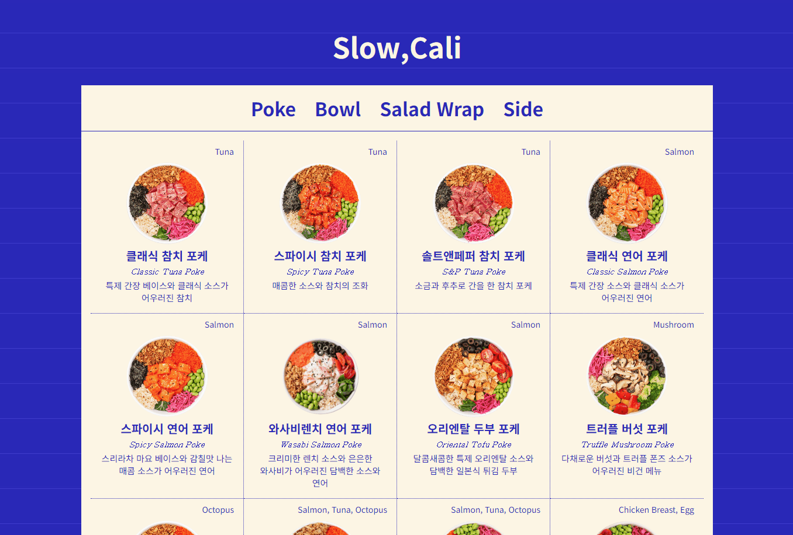

# 01 음식메뉴 앱



### 개요

- 객체 및 DOM, Event 다루기

### 필요한 기능

- 각 카테고리별로 메뉴 항목을 HTML 요소로 동적으로 생성하여 추가
- 탭을 클릭하면 활성화된 탭의 메뉴를 보여주기
- 초기 상태에서는 첫 번째(0번째) 카테고리 메뉴를 기본으로 보여주기

### 구현

data.js 파일에 필요한 데이터 정리

```javascript
poke: [
{
name: '클래식 참치 포케',
englishName: 'Classic Tuna Poke',
mainIngredient: 'Tuna',
description: '특제 간장 베이스와 클래식 소스가 어우러진 참치',
img: 'https://www.slowcali.co.kr/data/file/main_menu/3b25130ffa2b782b388a0db95e8c1b6f_ofB4aSuQ_855bd95ad4a7a0acd9c9e0d2ca708eab2b96d5cf.png',
},
...
```

예쁜 메뉴판을 만들고 싶어서 슬로우캘리 홈페이지에서 메뉴와 이미지를 가져다 사용했다.

```javascript
const categories = ["poke", "bowl", "wrap", "side"];
```

각 카테고리를 설정하고 forEach를 사용해 메뉴 생성하고 탭 클릭 이벤트를 준다.

```javascript
// 탭 클릭 이벤트
function handleTabClick() {
  const tabItems = document.querySelectorAll(".tab-item");
  const tabContents = document.querySelectorAll(".tab-content");

  tabItems.forEach((tab, index) => {
    tab.addEventListener("click", () => {
      // 탭 활성화
      tabItems.forEach((item) => item.classList.remove("active"));
      tab.classList.add("active");

      // 콘텐츠 활성화
      tabContents.forEach((content) => content.classList.remove("active"));
      const selectedCategory = categories[index];
      document.getElementById(selectedCategory).classList.add("active");
    });
  });
}
```

탭 & 메뉴 활성화 방법 : css에서 미리 설정한 active class로 현재 선택된 메뉴를 보여준다.

<hr>

html을 생성하는 방법은 여러가지가 있는데 이번 미션을 하면서 innerHTMl과 DOM 요소 직접 생성 방법에 대해서 더 알게된 사실이 있다.

단순히 둘 다 HTML을 생성한다고 생각했는데 innerHTML은 문자열로 HTML을 삽입하기 때문에 외부 입력을 그대로 반영할 경우 악성 스크립트가 실행될 수 있어 XSS 공격에 취약하고 DOM 요소를 직접 생성하는 방법은 데이터가 HTML 구조로 변환되는 과정을 명시적으로 제어하기 때문에 잠재적인 악성 스크립트가 삽입될 가능성을 줄여준다고 한다.
