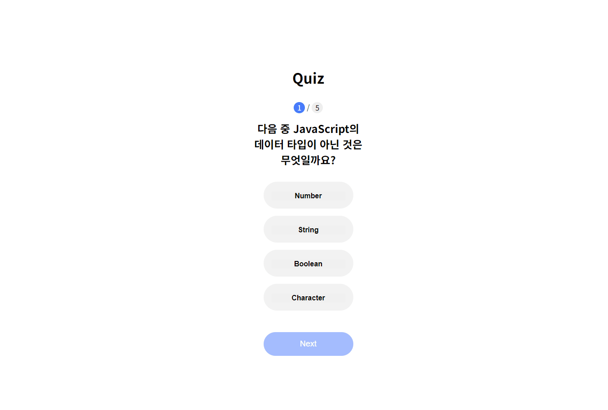

# 02 가위 바위 보 앱



### 개요

- 객체 및 DOM, Event 다루기 , Curry Function

### 필요한 기능

- 문제 1개씩 출력하기
- 문제 번호 보여주기
- 정답 확인 및 문제 설명 출력
- Next 버튼 눌렀을 때 다음 문제로 이동

### 구현

data.js 파일에 필요한 데이터 정리

```javascript
 {
    question: '다음 중 JavaScript의 데이터 타입이 아닌 것은 무엇일까요?',
    options: ['Number', 'String', 'Boolean', 'Character'],
    answer: 3, // Character
    explanation:
      'JavaScript의 기본 데이터 타입에는 Number, String, Boolean 등이 있지만, Character 타입은 존재하지 않습니다.',
  },
```

data.js에 문제들을 정리하고 이 데이터들을 바탕으로 DOM을 생성하여 문제를 보여준다.

```javascript
const handleAnswer = (correctAnswer, explanation) => (selectAnswer) => {
  quizResult.classList.add("active");

  if (selectAnswer == correctAnswer) {
    quizMessage.textContent = "🎉 정답입니다. 🎉";
  } else {
    quizMessage.textContent = "❌ 오답입니다. ❌";
  }

  quizExplanation.textContent = explanation;
};

// 정답 선택
quizContainer.addEventListener("click", (event) => {
  if (event.target.tagName === "BUTTON") {
    const answerItem = event.target.parentElement;
    const allAnswerItems = Array.from(answerItem.parentElement.children);

    const index = allAnswerItems.indexOf(answerItem);
    allAnswerItems.forEach((item) => item.classList.remove("active"));
    answerItem.classList.add("active");

    selectAnswer = index;

    // 정답 여부 확인
    const correctAnswer = quizQuestions[currentQuestionIndex].answer;
    const explanation = quizQuestions[currentQuestionIndex].explanation;

    const checkAnswer = handleAnswer(correctAnswer, explanation);
    checkAnswer(selectAnswer);

    nextButton.classList.add("active");
  }
});
```

`handleAnswer(correctAnswer, explanation)`에서 퀴즈의 정답과 설명을 받고 이후 선택된 답을 처리하고 정답 여부와 문제의 해설을 출력해준다.

준다. 다시하기 버튼을 누르면 `resetGame()` 함수를 호출해 게임을 초기화 시키고 다시 시작할 수 있다.

<hr>

강의에서 들은 것을 잘 활용하고 이게 맞는지 잘 모르겠다.

추가해서 넣은 부분은 문제 총 갯수, 현재 풀고 있는 문제 번호 보여주기, 정답여부 보여줄 때 문제 해설도 같이 출력하기, 문제 답을 선택하기 전에는 button 비활성화 처리 선택 후 활성화하기가 있다. 문제 데이터를 더 많이 만들어서 문제를 랜덤으로 출력하고 정답률을 보여주는 부분을 추가해도 좋을 것 같다.
