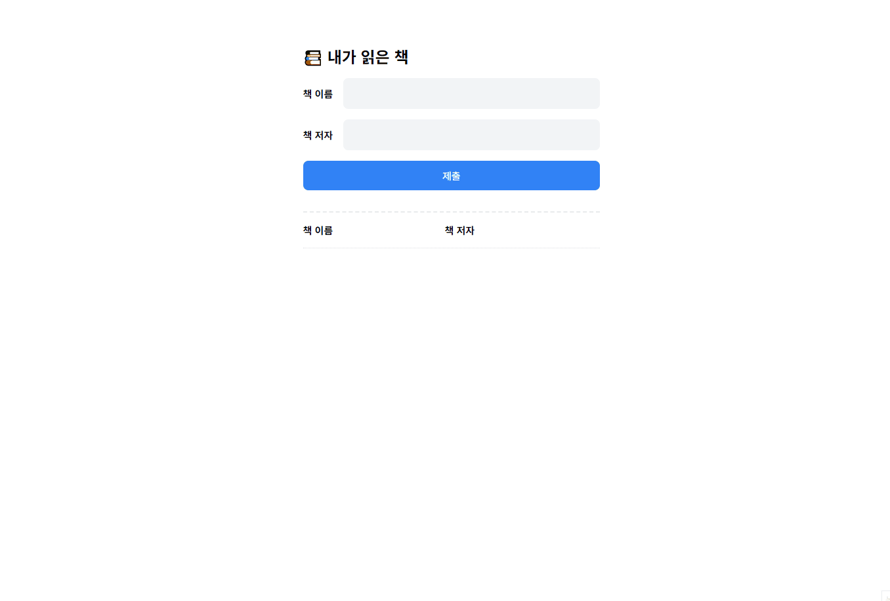

# 04 책 리스트 나열 앱



### 개요

- 기능별 클래스와 메서드 사용하기

### 필요한 기능

- 책 리스트 추가
- 사용자가 값 입력 후 input 필드 초기화 하기
- 책이 추가&삭제될 때 메세지 1초 보여주기

### 구현

class BookManager 에서는 데이터를 추가,삭제하고 목록을 관리한다.

```javascript
class BookUI {
  // constructor, init , showToast, handleDelete, createTableRow, handleAddBook 메서드 사용
}
```

class BookUI는 책을 추가하거나 삭제할때 이를 UI에 반영하고 이벤트를 처리한다.

```javascript
 constructor() {
    this.bookTitle = document.querySelector('.book-title');
    this.bookAuthor = document.querySelector('.book-author');
    this.submitButton = document.querySelector('button.submit');
    this.tableTbody = document.querySelector('.table .tbody');
    this.toastsArea = document.querySelector('.toasts');

    this.bookManager = new BookManager();

    this.init();
  }
```

DOM 요소들을 선택하고 BookManager 인스턴스를 생성

```javascript
init() {
    this.submitButton.addEventListener('click', this.handleAddBook.bind(this));
  }
```

사용자가 책을 추가하는 버튼을 누르면 handleAddBook 연결

```javascript
handleAddBook() {
    const titleValue = this.bookTitle.value;
    const authorValue = this.bookAuthor.value;

    if (titleValue && authorValue) {
      this.bookManager.addBook(titleValue, authorValue);
      this.createTableRow(
        titleValue,
        authorValue,
        this.bookManager.getBooks().length - 1
      );

      this.showToast('add');

      this.bookTitle.value = '';
      this.bookAuthor.value = '';
    } else {
      alert('책 이름과 저자 모두 입력해야 합니다.');
    }
  }
```

BookManager class 에 책 추가

createTableRow 메서드에서 해당 값을 받아 책 이름 / 저자 / 행 삭제 버튼 UI를 만들어준다.

showToast 메서드를 통해 책 추가 메세지 출력하고 input 필드를 초기화 한다.

```javascript
showToast(actionType) {
    const messageDiv = document.createElement('div');
    messageDiv.classList.add('toasts-message');

    if (actionType === 'add') {
      messageDiv.classList.add('add');
      messageDiv.textContent = '책이 추가되었습니다.';
    } else if (actionType === 'delete') {
      messageDiv.classList.add('delete');
      messageDiv.textContent = '책이 삭제되었습니다.';
    }

    this.toastsArea.appendChild(messageDiv);

    setTimeout(() => {
      this.toastsArea.removeChild(messageDiv);
    }, 1000);
  }
```

showToast 메서드는 현재 책이 추가된건지 삭제된건지 파라미터를 통해 받아 해당 메세지를 출력한다.

```javascript
 handleDelete(button, rowElement, index) {
    button.addEventListener('click', () => {
      this.tableTbody.removeChild(rowElement);
      this.bookManager.removeBook(index);
      this.showToast('delete');
    });
  }
```

삭제 메서드에서는 delete를 전달해 책이 삭제되었다는 메세지를 출력한다.

<hr>

처음에는 앞에 했던 미션과 같은 흐름으로 코드를 작성했지만, 섹션 6, 7에 해당하는 미션이기 때문에 클래스로 구조를 변경했다. 익숙한 방식대로 작성하려는 경향이 있는 것 같다. 앞으로는 조금 더 생각하고 코드를 짜야겠다. 배운건 활용해야 하니까.

하나의 책임을 가지는 클래스와 명확한 역할을 수행하는 메서드를 쓰고 싶었는데 하나의 클래스에서 너무 많은 메서드를 썼나 싶다.

미션을 하는 건 재밌는데 이렇게 해도 되는 게 맞는가 하는 생각이 든다.
