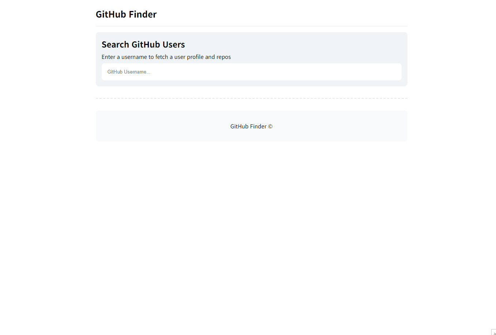

# 05 Github Finder앱



### 개요

- API 사용하기, 비동기

### 필요한 기능

- 사용자가 input에 입력하는 값 실시간으로 받기
- github API를 통해 유저 정보 보여주기
- 사용자 명(input 값)이 비어있을 때는 copyright를 보여줌

### 구현

```javascript
userID.addEventListener("input", (event) => {
  const username = event.target.value.trim();

  if (username === "") {
    copyright.classList.add("active");
    user.classList.remove("active");
  } else {
    copyright.classList.remove("active");
    user.classList.add("active");
    getUserProfileAndRepos(username);
  }
});
```

유저 id에는 공백이 들어가지 않기 때문에 input에서 사용자가 실수로 입력한 공백은 삭제해준다. `getUserProfileAndRepos()`함수로 입력된 값을 전달.

```javascript
async function getUserProfileAndRepos(username) {
  /*
 profileUrl , reposUrl 링크에서 username 받음 
 블로그에서 자꾸 이상하게 입력되어서 코드는 아래에 따로 뺐다. 
*/

  try {
    const [profileResponse, reposResponse] = await Promise.all([
      fetch(profileUrl),
      fetch(reposUrl),
    ]);

    if (profileResponse.ok && reposResponse.ok) {
      const profileData = await profileResponse.json();
      const reposData = await reposResponse.json();

      userImageElement(
        ".user-profile-img img",
        profileData.avatar_url,
        profileData.login
      );
      userTextElement(".user-profile-link", profileData.html_url, true);

      userTextElement(".user-repos span", profileData.public_repos);
      userTextElement(".user-gists span", profileData.public_gists);
      userTextElement(".user-followers span", profileData.followers);
      userTextElement(".user-following span", profileData.following);
      userTextElement(".user-company span", profileData.company);
      userTextElement(".user-website span", profileData.blog);
      userTextElement(".user-location span", profileData.location);
      userTextElement(
        ".user-member span",
        new Date(profileData.created_at).toLocaleDateString()
      );

      // 저장소 목록 최대 4개
      projectArea.innerHTML = "";

      reposData.slice(0, 4).forEach((repo) => {
        const projectElement = createProjectListElement(repo);
        projectArea.appendChild(projectElement);
      });
    } else {
      handleError();
    }
  } catch (error) {
    handleError();
  }
}
```

const profileUrl = `https://api.github.com/users/${username};`

const reposUrl = `https://api.github.com/users/${username}/repos;`

`Promise.all()`을 사용해 프로필 정보와 저장소 목록을 동시에 요청한다. response.ok를 통해 두 요청이 모두 성공했는지 확인하고 `.json()` 메서드를 호출해 응답된 값을 자바스크립트에서 사용 가능하도록 JSON 형식에서 자바스크립트 객체로 변환해준다.

요청이 실패하면 `handleError()`가 호출되어 에러 메세지가 표시된다. `handleError()` 함수에는 사용자 정보를 보여주는 UI를 초기화 하는 `clearUserProfileAndProjects()`함수와 User not found 메세지를 출력하는 `toggleActiveClass() `함수가 들어있어 두 함수가 같이 호출된다.

```javascript
function userTextElement(selector, value, isLink = false) {
  const element = document.querySelector(selector);
  if (element) {
    if (isLink) {
      element.href = value;
    } else {
      element.textContent = value || "N/A";
    }
  }
}

function userImageElement(selector, src, alt) {
  const image = document.querySelector(selector);
  if (image) {
    image.src = src;
    image.alt = alt;
  }
}
```

유저의 저장소 목록이 몇 개 있을지 모르기 때문에 하단의 저장소 목록은 `createProjectListElement() `함수를 통해 데이터를 전달 받아 DOM을 생성해 보여주고 상단의 유저 정보는 미리 생성된 el에 값을 넣어 보여준다.

유저 정보를 보여주기 위해 불러오는 document가 많아서 어떤 곳에 어떤 값이 들어가는지 한눈에 보고 싶어서 `userTextElement()`와 `userImageElement() `함수를 만들고 userTextElement('.user-repos span', profileData.public_repos); 이런식으로 코드를 써봤다.

<hr>

깃허브 API는 비인증 요청의 경우 시간당 60회 요청이 가능하기 때문에 따로 토큰 발급 받는 부분은 생략했다. API를 사용해 데이터를 받아 보여주는 작업이 재미있었다.
