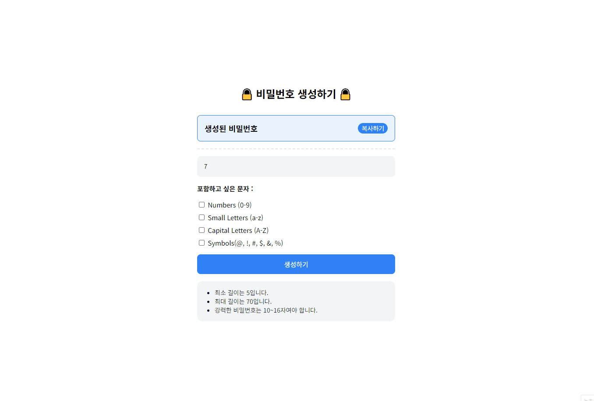

# 06 비밀번호 생성 앱 만들기



### 개요

- 조건에 따른 비밀번호 생성 기능 구현
- Generator, Design Pattern 을 사용해보기

### 필요한 기능

- 조건에 따른 비밀번호 생성
- 생성된 비밀번호 복사 기능

### 구현

```javascript
//문자 범위
const charSets = {
  numbers: "0123456789",
  small: "abcdefghijklmnopqrstuvwxyz",
  capital: "ABCDEFGHIJKLMNOPQRSTUVWXYZ",
  symbols: "@!#$&%",
};

//사용자 체크박스 설정
function getOptions() {
  return {
    numbers: document.getElementById("numbers").checked,
    small: document.getElementById("small").checked,
    capital: document.getElementById("capital").checked,
    symbols: document.getElementById("symbols").checked,
  };
}
```

```javascript
createButton.addEventListener("click", () => {
  const length = parseInt(inputLength.value, 10);
  const options = getOptions();

  /*비밀번호 생성 최소 조건 생략 */

  //Generator 사용할 때
  const generatedPassword = generatePassword(length, options);

  //Factory Pattern 사용할 때
  const generator = PasswordFactory.createPasswordGenerator(options);
  const generatedPassword = generator.generate(length);

  passwordElement.textContent = generatedPassword;
});
```

사용자가 선택한 비밀번호 길이와 옵션을 전달받아 비밀번호를 생성한다. 위의 설정들과 `shufflePassword(password)` 비밀번호 셔플 함수, `copyToClipboard(text)` 생성된 비밀번호 복사 함수는 같고 비밀번호 생성 과정만 다르다.

### Generator 사용

```javascript
function generatePassword(length, options) {
  const generator = passwordGenerator(options);
  let password = "";

  // 선택된 옵션 배열 추가
  const selectedSets = [];
  if (options.numbers) selectedSets.push(charSets.numbers);
  if (options.small) selectedSets.push(charSets.small);
  if (options.capital) selectedSets.push(charSets.capital);
  if (options.symbols) selectedSets.push(charSets.symbols);

  // 각 문자 집합에서 하나씩 선택하여 추가
  selectedSets.forEach((set) => {
    password += set.charAt(Math.floor(Math.random() * set.length));
    console.log(password);
  });

  // 나머지 자리에 대해 랜덤 문자 추가
  for (let i = password.length; i < length; i++) {
    password += generator.next().value;
  }

  // 비밀번호를 섞어서 반환
  return shufflePassword(password);
}
```

`generatePassword(length, options)`함수는 비밀번호를 생성하고 길이를 관리합니다.

- 사용자 설정 옵션 반영:사용자가 선택한 옵션 값에 따라 selectedSets 배열을 만듭니다. 이 배열은 선택된 문자 집합(숫자, 소문자, 대문자, 기호)을 포함합니다.
- 최소 하나의 문자 포함:selectedSets 배열을 반복하여 각 문자 집합에서 최소한 하나의 문자를 포함시킵니다. 이는 비밀번호가 선택된 옵션을 만족하도록 보장합니다.
- 남은 길이의 랜덤 문자 추가:나머지 비밀번호 길이에 대해서는 passwordGenerator를 사용하여 랜덤 문자를 생성합니다.
- 비밀번호 반환: 최종적으로 생성된 비밀번호는 지정된 길이와 사용자 옵션을 반영하여 반환됩니다.

```javascript
function* passwordGenerator(options) {
  const selectedSets = [];

  if (options.numbers) selectedSets.push(charSets.numbers);
  if (options.small) selectedSets.push(charSets.small);
  if (options.capital) selectedSets.push(charSets.capital);
  if (options.symbols) selectedSets.push(charSets.symbols);

  while (true) {
    const randomSet =
      selectedSets[Math.floor(Math.random() * selectedSets.length)];
    yield randomSet.charAt(Math.floor(Math.random() * randomSet.length));
  }
}
```

`passwordGenerator(options)` 함수는 비밀번호를 생성합니다.

- 무한 루프: while (true)를 사용하여 passwordGenerator()가 호출될 때 무한 루프를 실행합니다. 이 루프는 무작위 문자를 계속 생성하는 역할을 합니다.
- 무작위 문자 집합 선택: 선택된 옵션 배열을 파라미터로 받아 randomSet에서 무작위로 하나의 문자 집합을 선택합니다. Math.random()을 사용하여 0과 1 사이의 무작위 소수를 생성한 후, 이를 selectedSets.length와 곱하여 배열의 인덱스를 얻습니다. Math.floor()를 사용하여 소수를 정수로 변환함으로써 유효한 인덱스 범위 내에서 선택이 이루어지도록 합니다.
- 무작위 문자 선택: 위에서 선택된 문자 집합(randomSet)에서 문자를 선택합니다.예를 들어, 선택된 randomSet이 '0123456789'일 때, Math.random()이 0.65를 반환하면 0.65 \* 10 (randomSet.length) = 6.5 → Math.floor()에 의해 6이 되고charAt(index) 메서드를 사용하여 문자열에서 지정된 인덱스에 있는 문자를 반환합니다.
- 랜덤 문자 생성 반복: 이 과정을 호출될 때마다 반복합니다.

### Factory Pattern 사용

```javascript
// 비밀번호 생성기 클래스
class PasswordGenerator {
  constructor(options) {
    this.options = options;
    this.selectedSets = [];

    if (options.numbers) this.selectedSets.push(charSets.numbers);
    if (options.small) this.selectedSets.push(charSets.small);
    if (options.capital) this.selectedSets.push(charSets.capital);
    if (options.symbols) this.selectedSets.push(charSets.symbols);
  }

  // 비밀번호 생성
  generate(length) {
    let password = "";

    this.selectedSets.forEach((set) => {
      password += set.charAt(Math.floor(Math.random() * set.length));
    });

    while (password.length < length) {
      const randomSet =
        this.selectedSets[Math.floor(Math.random() * this.selectedSets.length)];
      password += randomSet.charAt(
        Math.floor(Math.random() * randomSet.length)
      );
    }

    return shufflePassword(password);
  }
}

class PasswordFactory {
  static createPasswordGenerator(options) {
    return new PasswordGenerator(options);
  }
}
```

`PasswordFactory.createPasswordGenerator(options)` 를 호출하여 `PasswordGenerator` 인스턴스를 생성한 후, 인스턴스의 `generate(length)` 메서드를 통해 비밀번호를 생성한다.

<hr>

배운 걸 사용해보고자 Generator 함수와 클래스를 썼다.
