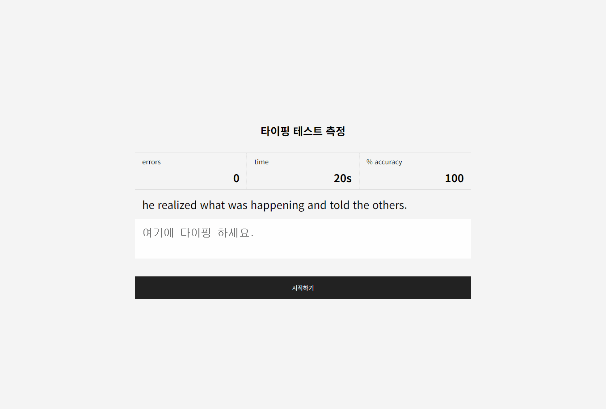

# 07 타이핑 테스트 앱 만들기



### 개요

- 타이핑 테스트 기능 구현
- 주어진 시간 내에 문장을 타이핑하고 입력 속도(WPM, CPM)와 정확도를 측정

### 필요한 기능

- 타이핑된 값
- 결과 팝업 보여주기

### 구현

초반에 필요하다고 생각되는 부분들을 셋팅한다.

```javascript
typingInput.addEventListener("input", () => {
  const spans = printText.querySelectorAll("span");
  const userInput = typingInput.value; // 사용자가 입력한 값

  userInputArray = userInput.split("");
  totalTypedCharacters = userInput.length; // 입력된 문자 수

  // 두 배열을 비교하여 클래스 추가
  for (let i = 0; i < currentTypingText.length; i++) {
    if (userInputArray[i] === currentTypingText[i]) {
      // 맞으면 'complete' 클래스 추가
      spans[i].classList.add("complete");
      spans[i].classList.remove("error");
    } else if (userInputArray[i] !== undefined) {
      // 'error' 클래스 추가
      spans[i]?.classList.remove("complete");
      spans[i].classList.add("error");
    } else {
      // 입력이 지워진 경우
      spans[i]?.classList.remove("complete");
      spans[i]?.classList.remove("error");
    }
  }

  // 오류 계산
  calculateErrors();
});
```

처음에는 input 값을 실시간으로 받고 현재 타이핑 해야 하는 문장과 비교를 했었는데 생각과 달리 정확한 비교가 어려웠다. 그래서 현재 타이핑 해야 하는 글자와 사용자가 입력한 글자를 모두 배열의 요소로 저장하고 비교하는 방법으로 바꾸고 span 요소에 class를 추가해 complete / error 를 표시했다.

```javascript
// 오류 수 계산
function calculateErrors() {
  // 현재 문장의 오류 수
  currentSentenceErrors = 0;

  // 현재 문장에서의 오류 수를 계산
  for (let i = 0; i < currentTypingText.length; i++) {
    if (
      userInputArray[i] !== currentTypingText[i] &&
      userInputArray[i] !== undefined
    ) {
      currentSentenceErrors++;
    }
  }

  // 전체 오류 수 업데이트 (이전 오류 수에 현재 문장 오류 추가)
  const totalErrorCount = totalErrors + currentSentenceErrors;
  errorsElement.textContent = totalErrorCount;

  // 정확도 계산
  calculateAccuracy(totalErrorCount);
}
```

원래는 오류 수 계산을 typingInput.addEventListener()의 for문에서 같이 처리했었는데, 다음 문장으로 넘어갈 때 오류 개수가 이상하게 업데이트 되는 바람에 함수로 분리하고 문장 별로 오류 수를 저장하고 업데이트하는 방식으로 변경했다. 오류 개수와 정확도는 화면에 실시간으로 반영되는 값이라 정확도 함수에 오류 수를 넘겨서 같이 업데이트 했는데 지금 보니까 그냥 같은 함수에서 처리해도 됐을 것 같다는 생각이 든다.

```javascript
function loadNextSentence() {
  // 현재 문장의 오류를 전체 오류에 누적
  totalErrors += currentSentenceErrors;
  // 새로운 문장 현재 문장 오류 초기화
  currentSentenceErrors = 0;

  currentSentenceIndex++;

  const nextSentence = TYPINGS[currentSentenceIndex];

  renderTextWithSpans(nextSentence);

  typingInput.value = "";
  userInputArray = [];
  typingInput.setAttribute("maxlength", currentTypingText.length);
}

// 엔터를 눌렀을 때 다음 문장 로드
typingInput.addEventListener("keydown", (_event) => {
  if (_event.key === "Enter") {
    // 기본 엔터 입력 방지
    _event.preventDefault();
    if (userInputArray.length === currentTypingText.length) {
      if (currentSentenceIndex < TYPINGS.length - 1) {
        // 엔터를 눌렀을 때 다음 문장 로드
        loadNextSentence();
      } else {
        // 마지막 문장일 때 결과 팝업 표시
        showTypingResult();
      }
    }
  }
});
```

다음 문장으로 넘어가는 함수에서는 textarea에 maxlength값을 넣어 타이핑해야 하는 글자 수 이상으로 타이핑하지 못하게 했다. enter을 눌렀을 때 다음 문장으로 바뀌는 방법으로 했더니 다음 문장으로 넘어갔을 때 textarea에 enter가 입력되면서 줄바꿈 처리가 되어서 `_event.preventDefault();` 로 줄바꿈이 되지 않게 했다.

```javascript
function startTimer() {
  timerInterval = setInterval(() => {
    if (currentTime > 0) {
      currentTime--;
      timeElement.textContent = currentTime;
    } else {
      clearInterval(timerInterval);
      typingInput.disabled = true;
      showTypingResult();
    }
  }, 1000);
}
```

마지막 문장까지 입력하고 enter을 누르면 결과 팝업이 뜨지만 처음 설정해둔 시간이 다 됐을 때도 결과 팝업이 뜬다.

```javascript
function initializeTypingTest() {
  calculateTotalCharacters();

  const firstSentence = TYPINGS[0];
  renderTextWithSpans(firstSentence);

  typingInput.setAttribute("maxlength", currentTypingText.length);

  errorsElement.textContent = INITIAL_ERRORS;
  timeElement.textContent = INITIAL_TIME;
  accuracyElement.textContent = INITIAL_ACCURACY;

  typingInput.value = "";
}
```

초기 값들도 상수로 선언해서 화면을 초기화 하는 함수에서 사용했다.

<hr>

이번에는 과제를 하기 전에 자바스크립트 명명 규칙을 지켜서 해보기로 했다. 자바스크립트 미션 중에서 제일 오래 걸렸던 미션이다. 처음 구현했을 때 생각했던대로 작동하지 않아서 어떻게 만들어야할지 고민이 많았다. 계속 수정해가며 기능을 완성시키기는 했는데 이게 맞는지.. 어려웠다.
