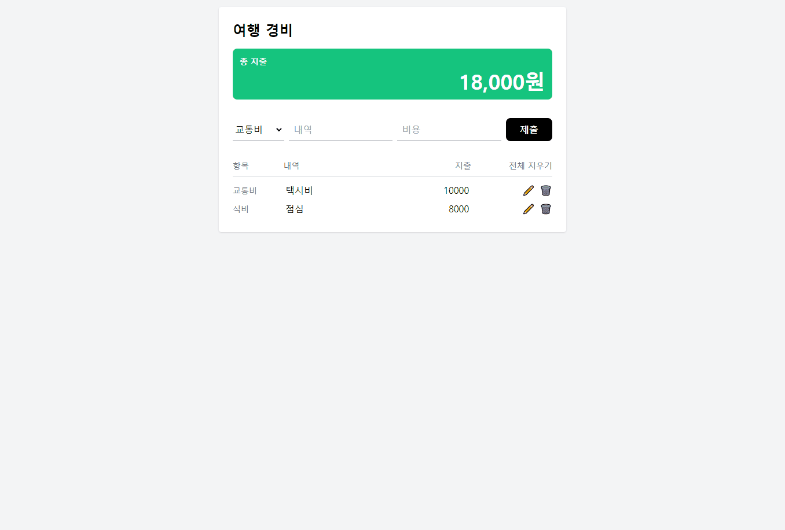

## 08 예산 계산기



### 기능목록

- 분류 / 지출 내역 / 비용 데이터를 받아 리스트 생성하기
- 추가 / 수정 / 삭제 이벤트 → toasts 메세지 1초 띄우기
- 총 비용 계산하기
- 전체 삭제 기능

### 구현

폴더구조

```javascript
📁src
├── App.js
├── App.css
├── 📁components
│   ├── ExpenseForm.js
│   ├── ExpenseList.js
│   └── ExpenseLists.js
```

데이터 구조 정하기

```javascript
expense: 항목,
details: 지출 내역,
amount: 비용,
```

### 1. ExpenseForm : 데이터 전달

데이터를 입력하고 제출을 누르면 App.js에 있는 `handleSubmit` 함수로 데이터 전달. `handleSubmit` 함수에서는 `const updatedData = [...prev, newExpenseData];` 스프레드 연산자를 사용해 배열에 새 항목을 추가한다.

> React에서는 상태(state)를 직접 수정하지 않고 새로운 값을 반환하는 방식으로 상태를 업데이트해야 한다. 불변성을 유지하는 것이 중요한 이유는 React가 상태가 변할 때 렌더링을 다시 수행하는데, 상태가 변경된 것을 인식하기 위해서는 참조가 완전히 새로운 값으로 바뀌어야 하기 때문.
> 강의에서 불변성에 대한 설명을 듣고 바로 기능을 만드니까 더 잘 기억에 남는다.

### 2. toasts 메세지 조건부 렌더링하기

```javascript
const showMessageWithColor = (status) => {
  let color;
  let message;

  if (status === "add") {
    message = "아이템이 생성되었습니다.";
    color = "#f0faf6";
  } else if (status === "edit") {
    message = "아이템이 수정되었습니다.";
    color = "#f0faf6";
  } else if (status === "delete") {
    message = "아이템이 삭제되었습니다.";
    color = "#fee";
  }

  setMessage(message);
  setMessageColor(color);
  setShowMessage(true);

  // 1초 후에 메시지 숨기기
  setTimeout(() => {
    setShowMessage(false);
  }, 1000);
};
```

- showMessage: 메시지를 표시할지 여부를 결정합니다. true 표시, false 숨김 처리
- message: 사용자에게 표시할 메시지 텍스트
- messageColor: 메시지의 배경색을 설정
- status 매개변수를 통해 메시지의 종류( 'add', 'edit', 'delete')를 구분한다.

```javascript
{
  showMessage && (
    <div
      className="w-full px-2 py-2 text-sm rounded-lg"
      style={{ backgroundColor: messageColor }}
    >
      {message}
    </div>
  );
}
```

- showMessage가 true일 때만 메시지 박스가 렌더링
- style 속성을 사용하여 messageColor를 배경색으로 설정

### 3. 총 지출 비용 계산

```javascript
const calculateTotalAmount = (data) => {
  return data.reduce((acc, item) => acc + item.amount, 0);
};
```

수정 버튼을 누르고 input을 수정할 때마다 값이 반영되어서 저장 버튼을 누르면 총 지출 비용을 계산하도록 함수로 따로 만들었다. 최종 값은 `toLocaleString() `사용해 쉼표가 포함된 형식으로 바꿔준다.

### 4. 항목 전체 삭제

ExpenseList에 있는 전체 치우기 버튼을 눌러주면 기존 배열에 들어있던 데이터를 지우고 `calculateTotalAmount()` 에도 값을 전달해 0으로 초기화 시켜준다.

<hr>

강의에서 들었던 To-Do 앱과 그렇게 큰 기능 차이가 나지 않았기 때문에 어렵지는 않았다. 강의 내용을 복기하면서 비슷한 흐름으로 만들었다. 리액트의 불변성을 지키고 최적화를 잘 고려해야겠다.
