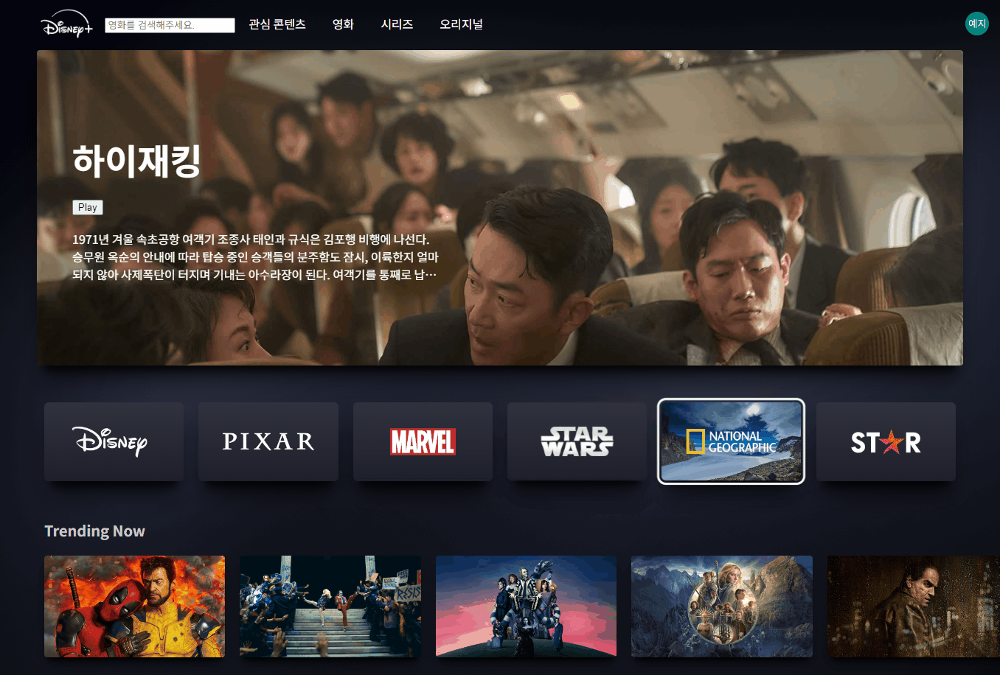

## 09 디즈니 플러스


로그인 전 화면


### 기능목록

- TMDb API 데이터 받아오기
- 검색 후 해당 아이템 클릭 시 영화 포스터 보여주기
- 영화 클릭 시 모달 오픈
- 슬라이드
- 구글 로그인

### 구현

- TMDb API 데이터

api로 데이터를 받아오는 방법은 강의에서 넷플릭스 앱 만들기에서 배웠던 걸 그대로 사용했다.

axios.js 에서 baseURL을 설정하고 나머지 데이터를 받아올 주소도 requests에 설정해준다.

- Google OAuth2 구글 로그인

구글 로그인 구현하는 방법은 검색하면 친절하게 설명되어 있는 블로그 글들이 많아 따라했다.

api 키는 .env 파일에 담아서 커밋했을 때 깃허브에 올라가지 않게 한다.

```javascript
const [loggedIn, setLoggedIn] = useState(false);
const [user, setUser] = useState(null);

const CLIENT_ID = process.env.REACT_APP_GOOGLE_ID;
const CLIENT_SECRET = process.env.REACT_APP_GOOGLE_PW;
const REDIRECT_URI = "http://localhost:3000";
const SCOPE = process.env.REACT_APP_GOOGLE_SCOPE;
```

loggedIn : 사용자가 로그인 했는지 여부를 저장. 기본 값 false

user : 사용자 정보 저장. 로그인 되면 사용자 정보가 저장된다.

`CLIENT_ID CLIENT_SECRET` env 파일에 있는 클라이언트ID와 비밀번호를 가져온다.

`REDIRECT_URI` : OAuth2 인증 후, 리다이렉션할 URL 로컬 개발 환경이라 http://localhost:3000으로 설정.

### 로그인

```javascript
const handleGoogleLogin = () => {
  const googleOAuthUrl = `https://accounts.google.com/o/oauth2/auth?client_id=${CLIENT_ID}&redirect_uri=${REDIRECT_URI}&response_type=code&scope=${SCOPE}`;
  window.location.href = googleOAuthUrl;
};
```

사용자가 로그인 버튼을 클릭했을 때 호출하는 함수.

`googleOAuthUrl` OAuth2 인증 URL을 생성하고, 그 URL로 이동. URL로 이동하면 Google 로그인 페이지가 열리고, 사용자가 Google 계정으로 로그인하게 된다.

### 로그아웃

```javascript
const handleLogout = () => {
  // 로그아웃 시 로컬 스토리지에서 사용자 정보 삭제
  localStorage.removeItem("user");
  localStorage.removeItem("access_token");
  setUser(null);
  setLoggedIn(false);
};
```

로그아웃 버튼을 누르면 호출된다. 로컬스토리지에 저장된 사용자 정보와 액세스 토큰을 삭제하고 상태를 초기화하여 로그아웃 상태로 만든다.

### 로그인 후



```html
<nav user="{user}" onLogout="{onLogout}" />
```

로그인할때 받은 유저 정보를 통해 오른쪽 상단에 구글 프로필 이미지를 넣어줬다.

#### 동영상 배너

```javascript
<GenreContainer>
  {items.map((item, index) => (
    <GenreContainerBox
      key={index}
      onMouseEnter={() => handleMouseEnter(index)}
      onMouseLeave={() => handleMouseLeave(index)}
    >
      <div>
        <GenreContainerVideo
          ref={(el) => (videoRefs.current[index] = el)}
          playsInline
          loop
          muted
          data-testid="brand-set-video"
        >
          <source
            src={item.videoSrc}
            type="video/mp4"
            data-testid="brand-set-video-source"
          />
        </GenreContainerVideo>
        <GenreContainerBoxImg src={item.imgSrc} alt="" />
      </div>
    </GenreContainerBox>
  ))}
</GenreContainer>
```

동영상/이미지를 다 넣으니 코드가 너무 길어져서 영상, 이미지 주소는 items라는 배열에 담아서 사용했다.

```javascript
const videoRefs = useRef([]);

const handleMouseEnter = (index) => {
  if (videoRefs.current[index]) {
    videoRefs.current[index].play();
  }
};

const handleMouseLeave = (index) => {
  if (videoRefs.current[index]) {
    videoRefs.current[index].pause();
  }
};
```

`handleMouseEnter`, `handleMouseLeave` 마우스 이벤트를 사용해 hover 상태일 때 동영상을 재생시키고 일시 정지 시켰다. 동영상이 보였다 안 보이는 하는 건 css에서 opacity로 처리했다.

<hr>

처음에 다 만들고 동작 상태를 확인하다가 다른 페이지에서 메인으로 넘어왔을 때 로그인 상태가 유지가 되지 않아 유저 정보를 로컬 스토리지에 저장해서 구분했다. 로컬 스토리지에 이런 정보를 저장해도 되는 건지 모르겠지만.. 이런 로그인 연동에 대해 좀 더 알아봐야겠다.

디즈니 메인 화면 보고 싶은데 볼 수가 없어서 한 달 정도 디즈니 플러스 결제를 했다. 스터디가 끝나면 재밌는 영화보는 시간을 가져야겠다.
