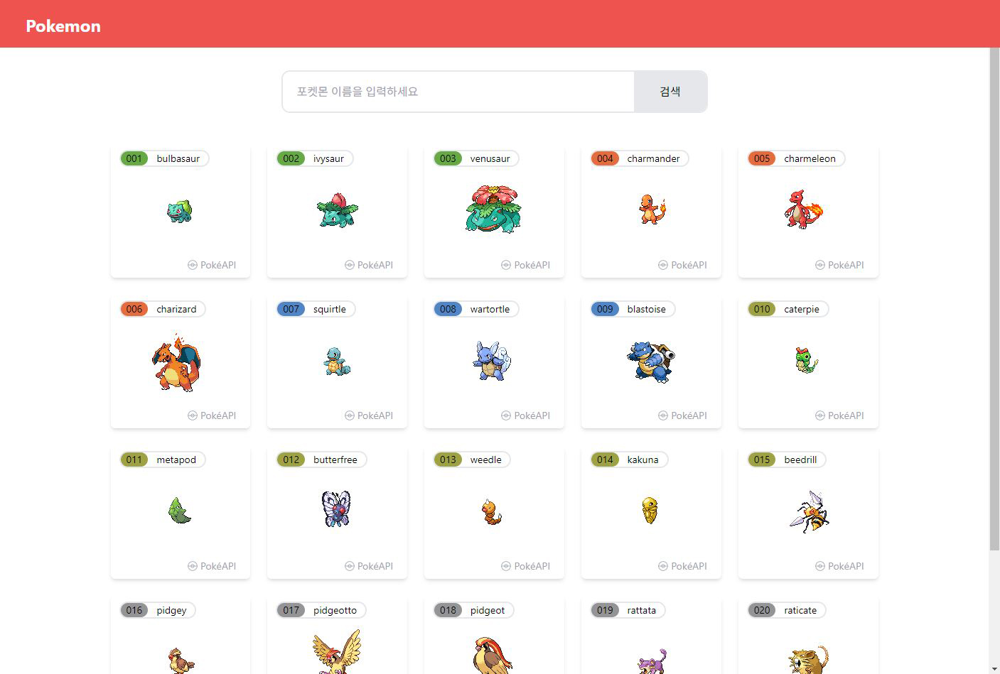
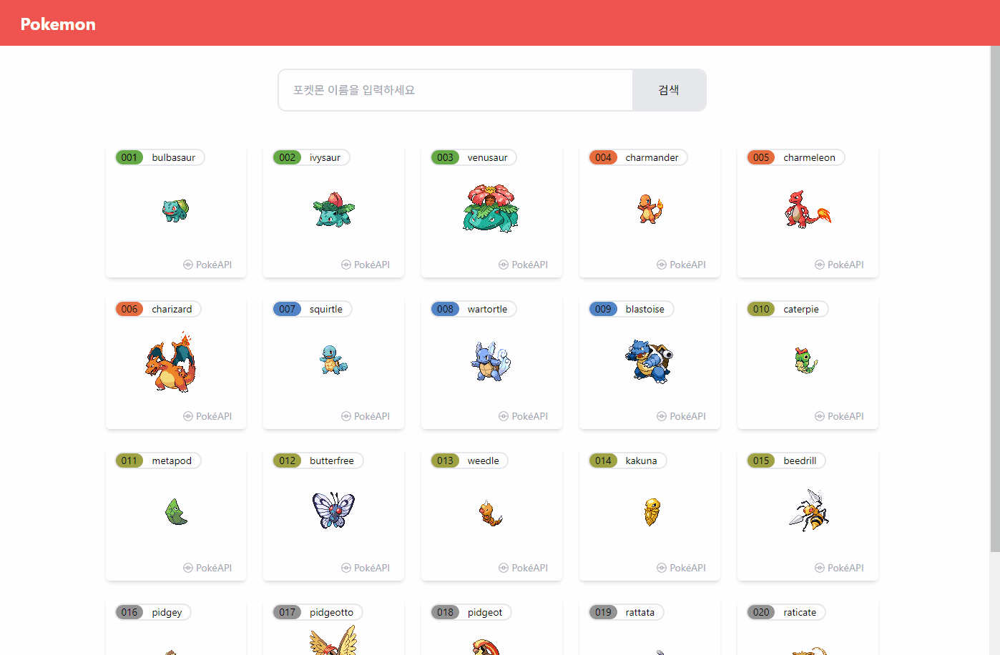
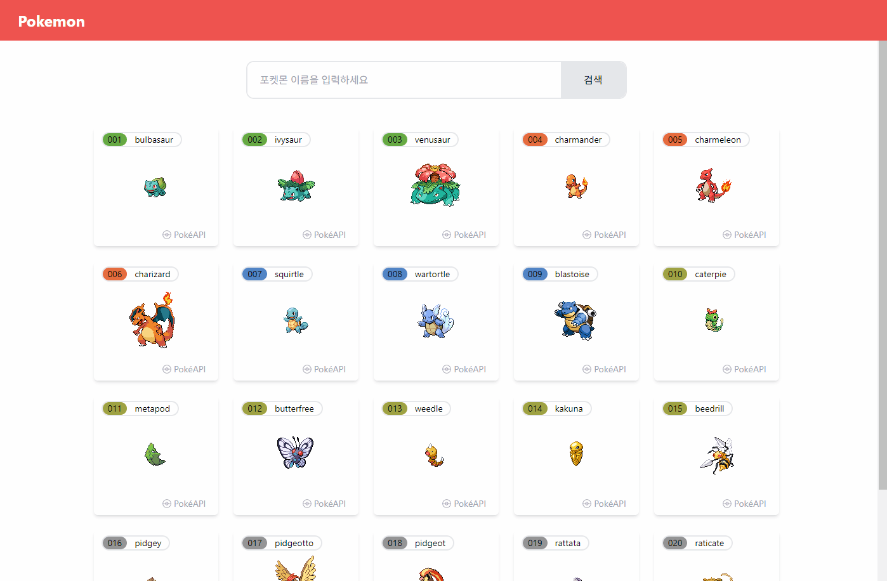
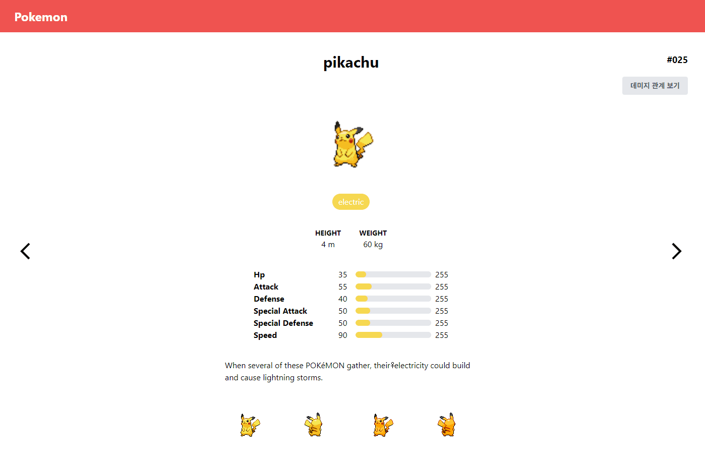

## 10 포켓몬 도감 앱 만들기



### 기능목록

- PokéAPI를 사용하여 포켓몬 목록과 세부 정보를 요청하고 화면에 표시
- 더보기 버튼 눌렀을 때 추가 데이터 요청
- 포켓몬 고유 ID(숫자)를 사용하여 이전/다음 페이지 구현
- 포켓몬의 타입에 따른 데미지 상성 관계를 모달 창으로 제공

### 구현

폴더구조

```javascript
📁src
├── App.js
├── App.css
├── 📁components
│   ├── Modal.js
│   ├── Nav.js
│   ├── PokemonList.js
│   └── SearchInput.js
├── 📁hooks
│   ├── useFetchPokemonData.js
│   └── useFetchPokemonDetail.js
├── 📁pages
│   ├── Detail.js
│   └── Main.js
```

### 메인에서 추가 데이터 요청하기



PokemonList.js 과 useFetchPokemonData.js 훅  
useFetchPokemonData.js : 페이지 번호에 따라 Pokémon 데이터를 가져오는 역할

```javascript
export const useFetchPokemonData = (pageNumber) => {
  const [pokemonData, setPokemonData] = useState([]);
  const [isLoading, setIsLoading] = useState(false);

  useEffect(() => {
    const fetchPokemonData = async () => {
      setIsLoading(true);
      try {
        const promises = [];
        // 한 페이지당 20개의 포켓몬 데이터 가져오기
        const start = (pageNumber - 1) * 20 + 1; // 예: 1 페이지면 1~20, 2페이지면 21~40
        const end = pageNumber * 20;

        for (let i = start; i <= end; i++) {
          promises.push(axios.get(requests.fetchPokemonById(i)));
        }
        const responses = await Promise.all(promises);
        const newData = responses.map((response) => response.data);
        setPokemonData((prevData) => [...prevData, ...newData]); // 기존 데이터에 추가
      } catch (error) {
        console.error("포켓몬 데이터를 가져오는 중 오류 발생:", error);
      } finally {
        setIsLoading(false);
      }
    };

    fetchPokemonData();
  }, [pageNumber]);

  return { pokemonData, isLoading };
};
```

상태관리 :

pokemonData: 가져온 Pokémon 데이터 배열을 저장

isLoading: 데이터 로딩 중 여부를 보여준다. (true 또는 false)

데이터 가져오기 :

useEffect 훅을 사용하여 pageNumber가 변경될 때마다 데이터를 가져온다.

fetchPokemonData라는 비동기 함수를 정의하고, 여기서 Pokémon 데이터를 API를 통해 가져옴

1. const { pokemonData, isLoading } = useFetchPokemonData(pageNumber); 훅에 pageNumber = 1 전달

2. fetchPokemonData 함수 내에서

```javascript
const start = (pageNumber - 1) * 20 + 1; // 예: 1 페이지면 1~20, 2페이지면 21~40
const end = pageNumber * 20;
```

start 계산 : pageNumber 가 1일때 :첫 번째 페이지의 첫 번째 Pokémon ID가 1임을 나타낸다.

end 계산 : 첫 번째 페이지의 마지막 Pokémon ID가 20임을 나타낸다.

3. 데이터 요청

```javascript
for (let i = start; i <= end; i++) {
  promises.push(axios.get(requests.fetchPokemonById(i)));
}
```

baseUrl(axios) + fetchPokemonById (requests) → https://pokeapi.co/api/v2//pokemon/${id}

for 루프를 통해 Pokémon 데이터를 가져오기 위해 API에 요청하고 const promises = []; 배열에 데이터 추가함

4. 데이터 수신 및 상태 업데이트

```javascript
const responses = await Promise.all(promises);
const newData = responses.map((response) => response.data);
setPokemonData((prevData) => [...prevData, ...newData]);
```

`responses` 모든 Promise가 이행되면, 이행된 결과를 포함하는 배열을 반환, responses는 20개의 응답 객체를 포함

`newData` responses 배열에서 각 응답의 실제 데이터 부분을 추출

`setPokemonData() `기존 데이터에 새 데이터 추가

#### PokemonList.js

더보기 데이터 요청

```javascript
const handleLoadMore = () => {
  setPageNumber((prevPageNumber) => prevPageNumber + 1);
};
```

사용자가 '더보기' 버튼을 클릭하면 handleLoadMore 함수가 실행 이 함수에서는setPageNumber를 호출

`fetchPokemonData` 함수 내에서 start와 end 값을 다시 계산

> start = (2 - 1) \* 20 + 1 = 21
> end = 2 \* 20 = 40

```javascript
{
  !isLoading ? (
    <button
      className="my-9 text-lg bg-gray-200 text-gray-600 px-9 py-2 rounded"
      type="button"
      onClick={handleLoadMore}
    >
      더보기
    </button>
  ) : (
    <div className="my-9 text-lg">Loading...</div>
  );
}
```

처음에는 const [isLoading, setIsLoading] = useState(false); 표시 → setIsLoading(true); 상태 업데이트

isLoading이 true일 경우 'Loading...' 메시지를 표시하고, false일 경우 '더보기' 버튼을 보여준다.

### 포켓몬 타입별 색상코드 적용.

```css
.bg-normal {
  background-color: #949495;
}
```

api데이터로 타입을 받아서 bg-${type} 형식으로 class지정.

css에서 타입별 색상 코드를 적용해 놓는다.

<b>포켓몬 넘버 3자리 수로 변경 1 → 001</b>

```javascript
{
  String(pokemon.id).padStart(3, "0");
}
```

### 포켓몬 검색 기능



<b>검색기능</b>

```javascript
export default function SearchInput() {
  const [searchTerm, setSearchTerm] = useState("");
  const navigate = useNavigate();

  const handleSearch = () => {
    if (searchTerm.trim()) {
      navigate(`/${searchTerm.toLowerCase()}`);
    }
  };

  return (
    <div className="max-w-3xl py-7 w-full flex justify-center items-center mx-auto">
      <div className="flex w-full max-w-[600px] rounded-xl border-2 border-gray-200 overflow-hidden">
        <input
          type="text"
          className="px-5 py-4 w-full focus:outline-none"
          value={searchTerm}
          onChange={(e) => setSearchTerm(e.target.value)}
          placeholder="포켓몬 이름을 입력하세요"
        />
        <button
          className="whitespace-nowrap px-9 bg-gray-200"
          onClick={handleSearch}
        >
          검색
        </button>
      </div>
    </div>
  );
}
```

포켓몬 이름을 입력하고 검색 버튼을 누르면 해당 이름의 페이지로 이동한다.

포켓몬 영문 이름은 소문자이기 때문에 toLowerCase() 를 사용해서 입력된 값이 소문자로 넘어가게 한다. trim()으로 있을지 모르는 공백 제거도 해준다.

<b>디테일 페이지와 모달</b>

- Detail.js 컴포넌트와 useFetchPokemonDetail.js 훅



Detail.js 컴포넌트는 특정 포켓몬의 세부 정보를 보여주는 컴포넌트.

포켓몬 이름을 URL에서 가져와 해당 포켓몬의 데이터를 요청하고, 포켓몬 설명 및 타입에 따른 데미지 관계 정보를 함께 표시한다.

```javascript
export default function Detail() {
  const { id: pokemonName } = useParams();
  const { pokemon, description, damageRelations } = useFetchPokemonDetail(pokemonName);
  const [isModalOpen, setIsModalOpen] = useState(false);
  const navigate = useNavigate();

  if (!pokemon) {
    return <div>Loading...</div>;
  }

  // 모달 열기/닫기 기능
  const handleOpenModal = () => setIsModalOpen(true);
  const handleCloseModal = () => setIsModalOpen(false);

  // 이전 포켓몬 데이터로 이동 (ID로 요청)
  const handlePrev = () => {
    const prevId = pokemon.id - 1;
    if (prevId >= 1) {
      axios.get(requests.fetchPokemonById(prevId)).then((response) => {
        setIsModalOpen(false);
        navigate(`/${response.data.name.toLowerCase()}`);
      });
    }
  };
//다음 포켓몬
const handleNext = () => {/*생략*/}

return (

  //생략

 {/* 모달이 열렸을 때만 렌더링 */}
  {isModalOpen && (
    <Modal damageRelations={damageRelations} onClose={handleCloseModal} />
  )}
 )
};
```

1. 포켓몬 이름 가져오기 useParams 사용

```javascript
const { id: pokemonName } = useParams();
```

PokemonList.js 에서 onClick={() => navigate(`/${pokemon.name}`)} URL에 있는 포켓몬 이름을 가져와서 id 값으로 쓴다.

2. 훅 useFetchPokemonDetail.js 포켓몬 이름으로 데이터 요청

```javascript
const { pokemon, description, damageRelations } =
  useFetchPokemonDetail(pokemonName);
```

해당 포켓몬의 정보 (pokemon), 설명 (description), 데미지 관계 (damageRelations)를 받아온다.

3. 로딩 상태 처리  
   포켓몬 데이터가 아직 로드되지 않았다면 Loading... 메시지를 표시한다.

```javascript
if (!pokemon) {
  return <div>Loading...</div>;
}
```

4. 모달 열기/닫기:

```javascript
const [isModalOpen, setIsModalOpen] = useState(false);

// 모달 열기/닫기 기능
const handleOpenModal = () => setIsModalOpen(true);
const handleCloseModal = () => setIsModalOpen(false);
```

isModalOpen 상태를 사용하여 모달의 열림/닫힘을 관리한다.

5. 이전/다음 포켓몬으로 이동:

```javascript
const handlePrev = () => {
  const prevId = pokemon.id - 1;
  if (prevId >= 1) {
    axios.get(requests.fetchPokemonById(prevId)).then((response) => {
      setIsModalOpen(false);
      navigate(`/${response.data.name.toLowerCase()}`);
    });
  }
};
```

API를 통해 받아온 포켓몬의 고유 ID 값 사용.

handlePrev 함수는 현재 포켓몬의 ID에서 1을 빼서 이전 포켓몬으로 이동한다.

ID가 1 이상일 경우, 이전 포켓몬의 데이터를 요청하고, 응답받은 이름으로 URL을 변경. 다음 이동 함수도 같은 내용.

useFetchPokemonDetail 훅 : 포켓몬의 이름을 받아 해당 포켓몬의 세부 정보, 설명, 데미지 관계 정보를 가져온다.

```javascript
export const useFetchPokemonDetail = (pokemonName) => {
  //생략

  return { pokemon, description, damageRelations };
};
```

1. 상태관리

```javascript
const [pokemon, setPokemon] = useState(null);
const [description, setDescription] = useState("");
const [damageRelations, setDamageRelations] = useState(null);
```

pokemon: 포켓몬의 기본 데이터를 저장

description: 포켓몬의 설명을 저장

damageRelations: 포켓몬 타입에 따른 데미지 관계 데이터를 저장

2. 포켓몬 데이터 요청:

```javascript
useEffect(() => {
  const fetchPokemonDetail = async () => {
    try {
      // 포켓몬 기본 정보 요청
      const response = await axios.get(
        requests.fetchPokemonByName(pokemonName)
      );
      setPokemon(response.data);

      // 포켓몬 설명
      const speciesResponse = await axios.get(
        requests.fetchPokemonSpecies(pokemonName)
      );
      const flavorTextEntry = speciesResponse.data.flavor_text_entries.find(
        (entry) => entry.language.name === "en"
      );

      setDescription(
        flavorTextEntry
          ? flavorTextEntry.flavor_text
          : "No description available."
      );

      // 포켓몬 타입에 따른 데미지 관계 가져오기
      if (response.data.types.length > 0) {
        const typeName = response.data.types[0].type.name; // 첫 번째 타입 선택
        const typeResponse = await axios.get(
          requests.fetchPokemonType(typeName)
        );
        setDamageRelations(typeResponse.data.damage_relations); // 데미지 관계 설정
      }
    } catch (error) {
      console.error("포켓몬 데이터를 가져오는 중 오류 발생:", error);
    }
  };

  fetchPokemonDetail();
}, [pokemonName]);
```

useEffect는 pokemonName이 변경될 때마다 실행된다.

axios.get을 사용하여 포켓몬 이름으로 기본 데이터를 요청하고, setPokemon으로 상태를 업데이트.

가져온 데이터에서 영어 설명(flavor_text_entries)을 찾아서 설명 상태에 저장 만약 설명이 없으면 기본 메시지를 설정한다.

포켓몬의 타입 정보가 있으면 첫 번째 타입의 이름을 사용하여 해당 타입에 대한 데미지 관계 정보를 요청하고 이 데이터를 damageRelations 상태로 저장.

pokemon, description, damageRelations 데이터를 반환하여 Detail.js에서 사용할 수 있게 한다.
