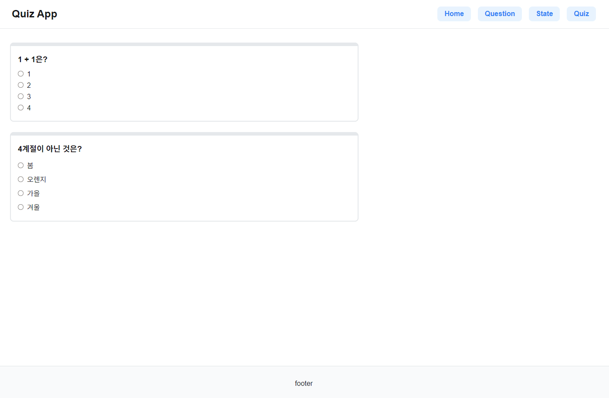
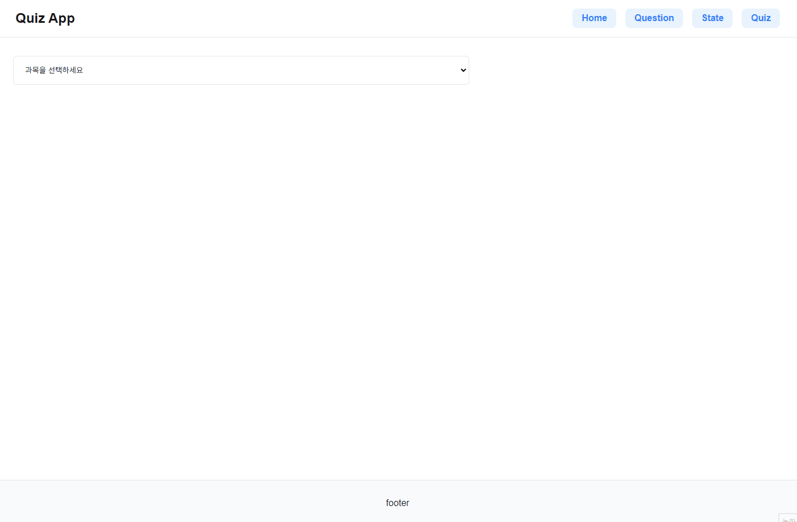
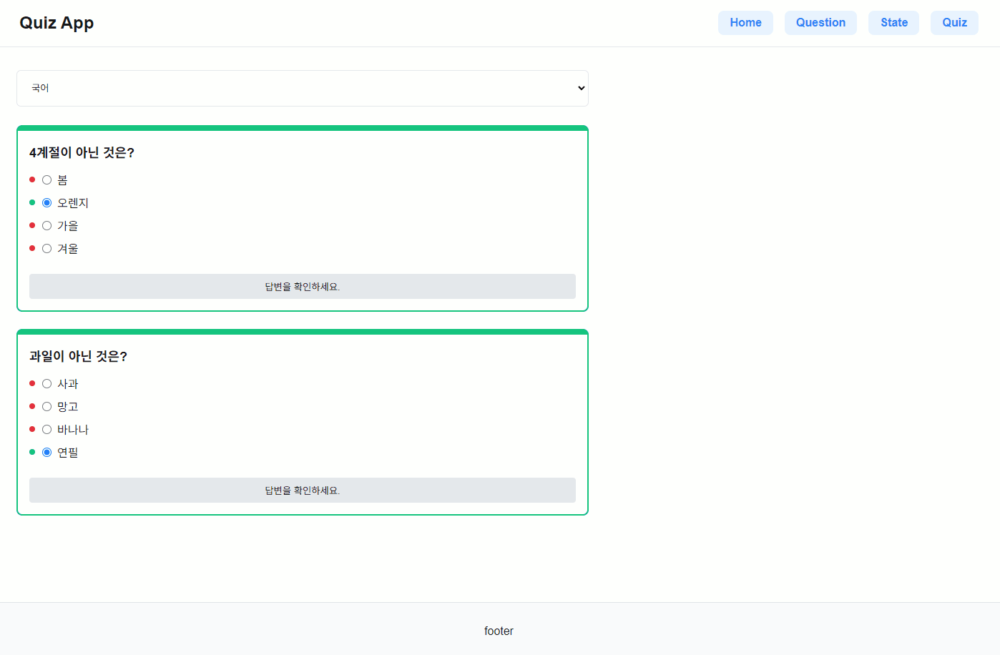

## 11 퀴즈 앱 만들기



### 기능목록

- 퀴즈 풀었을 때 → 정답버튼 띄우기 → 답 확인 기능 플로우
- /question 에서 문제 2개 랜덤 출력
- /state 에서 선택된 카테고리의 문제 랜덤 출력
- /quiz 에서 선택 카테고리 문제 출력 & 진행률 & 결과 보여주기

### 구현

폴더구조

```javascript
📁public
├── 📁data
│   └── questions.json
📁src/app
├── layout.tsx
├── page.tsx
├── 📁components
│   └── Questions.tsx //문제 UI
├── 📁hooks
│   └── useQuestionHandler.ts
├── 📁question
│   └── page.tsx
├── 📁quiz
│   └── page.tsx
├── 📁state
│   └── page.tsx
```

<b>/components/Questions.tsx</b>
/question 페이지와 /state 페이지에서 쓰는 문제 스타일은 똑같아서 컴포넌트를 만들어서 가져다가 사용했다.

지금 생각해보니 /quiz 도 비슷한데 class 타입을 다르게 만들어서 적용할걸 그랬나 싶다.

```javascript
interface QuestionProps {
  question: string; //문제
  choices: string[]; //선택지
  selectedAnswer: string; //선택한 답변
  resultClasses: string[]; //결과 class
  isButtonActive: boolean; //버튼 활성화 여부
  questionAreaClass: string; //질문 영역 class
  onChange: (event: ChangeEvent<HTMLInputElement>) => void; // input 핸들러
  onCheckAnswer: () => void; // 정답 확인 호출 핸들러
  questionIndex: number; // 문제 고유 index
}
```

Questions 컴포넌트에서 사용할 props를 정의한다.

```javascript
export const Question: React.FC<QuestionProps> = ({
  question,
  choices,
  selectedAnswer,
  resultClasses,
  isButtonActive,
  questionAreaClass,
  onChange,
  onCheckAnswer,
  questionIndex,
}) => {
  return (
    <div className={`question-area ${questionAreaClass}`}>
      <p>{question}</p>
      <ul className="question-item">
        {choices.map((choice, choiceIndex) => (
          <li key={choiceIndex}>
            <span></span>
            <input />
            <label></label>
          </li>
        ))}
      </ul>
      <button></button>
    </div>
  );
};
```

문제 UI 구조는 이렇게 생겼다. 다 같이 쓰면 코드가 이상하게 써져 span, input, label,button 은 아래 따로 뺐다.

```javascript
<span
  className={`icon ${
    resultClasses && resultClasses[choiceIndex]
      ? resultClasses[choiceIndex]
      : ""
  }`}
></span>
```

사용자가 답을 선택했을 때 답 앞에 동그라미로 이 답이 정답인지 오답인지 알려주는 용도이다.

```javascript
<input
type='radio'
id={} // 고유한 id 설정
name={`question-${questionIndex}`} // 고유한 name 설정
value={choice} // 선택지 값
checked={selectedAnswer === choice} // 선택한 답변 확인
onChange={onChange} // 선택 핸들러 호출
/>
```

id= choice-questionIndex − questionIndex−{choiceIndex}

한 문제가 가지는 4개의 radio input은 다 같은 name을 가지고 있다. 같은 name을 가지는 요소끼리 하나의 그룹으로 취급되어 같은 그룹 내에서 하나의 라디오 버튼만 선택할 수 있다.

```javascript
<button
  className={`result ${isButtonActive ? "active" : ""}`}
  type="button"
  onClick={onCheckAnswer} // 정답 확인 핸들러 호출
>
  답변을 확인하세요.
</button>
```

그룹 내에서 하나의 input을 고르면 답을 확인하라는 버튼이 보여주고 버튼을 누르면 상위 div인 question-area와 span 태그에 class가 붙는다. 정답이면 correct / 오답이면 wrong 붙어 색으로 구분이 가능하다.

<b>/question : 문제 2개 랜덤 출력 페이지</b>


```javascript
const [questions, setQuestions] = useState<Question[]>([]); // 문제 배열

  useEffect(() => {
    // JSON 파일에서 데이터 불러오기
    fetch('/data/questions.json')
      .then((res) => res.json())
      .then((data) => {
        // 수학 문제에서 랜덤으로 하나 선택
        const randomMath =
          data.math[Math.floor(Math.random() * data.math.length)];
        // 국어 문제에서 랜덤으로 하나 선택
        const randomKorean =
          data.korean[Math.floor(Math.random() * data.korean.length)];

        // 두 문제를 새로운 배열에 담기
        setQuestions([randomMath, randomKorean]);
      });
```

/public/data/questions.json에 있는 데이터를 가져와 랜덤으로 출력해준다.

수학 1문제, 국어 1문제를 출력하도록 설정했다.

<b>/state : 선택 과목 문제 랜덤 출력</b>



/public/data/questions.json에 있는 데이터를 가져와 랜덤으로 출력해준다.

선택한 카테고리의 문제 2개를 랜덤으로 출력한다.

```javascript
// 과목 선택 시 JSON 파일에서 해당 과목 문제를 2개 랜덤으로 선택
useEffect(() => {
  if (selectedSubject !== "") {
    setIsLoading(true); // 문제를 불러오는 동안 로딩 상태로 설정
    resetState(); // 과목이 바뀔 때 상태 초기화

    fetch(`/data/questions.json`)
      .then((res) => res.json())
      .then((data) => {
        if (selectedSubject === "math") {
          const randomMathQuestions = getRandomQuestions(data.math, 2); // 수학 문제 2개 선택
          setQuestions(randomMathQuestions);
        } else if (selectedSubject === "korean") {
          const randomKoreanQuestions = getRandomQuestions(data.korean, 2); // 국어 문제 2개 선택
          setQuestions(randomKoreanQuestions);
        }
        setIsLoading(false); // 문제를 불러온 후 로딩 상태 해제
      });
  }
}, [selectedSubject]);
```

두 페이지에서 사용하는 사용하는 핸들러는 같다.

/hooks/useQuestionHandler.ts 를 사용하고 있다.

```javascript
return (
  <div className="question">
    {questions.map((question, index) => (
      <Question
        key={index} // 고유 키 설정
        question={question.question} // 질문 텍스트 전달
        choices={question.choices} // 선택지 전달
        selectedAnswer={selectedAnswers[index]} // 선택한 답변 전달
        resultClasses={resultClasses[index]} // 결과 클래스 전달
        isButtonActive={isButtonActive[index]} // 버튼 활성화 상태 전달
        questionAreaClass={questionAreaClasses[index]} // 질문 영역 클래스 전달
        onChange={(event) => handleChange(event, index)} // 선택 핸들러
        onCheckAnswer={() => checkAnswer(index)} // 정답 확인 핸들러
        questionIndex={index} // 질문 인덱스 전달
      />
    ))}
  </div>
);
```

Question 컴포넌트에서 넘어오는 정보로 UI를 핸들링 한다.

```javascript
{
    "id": 1,
    "question": "1 + 1은?",
    "choices": ["1", "2", "3", "4"],
    "answer": 1
},
```

만약 내가 이 데이터 문제에서 4번째 답을 골랐다면

useQuestionHandler의 handleChange 함수가 호출된다.

```javascript
const handleChange = (event: ChangeEvent<HTMLInputElement>, index: number) => {
  const selectedValue = event.target.value; //input 의 value 값인 4를 가져옴
  const newSelectedAnswers = [...selectedAnswers];
  newSelectedAnswers[index] = selectedValue; // 선택한 답변 저장
  setSelectedAnswers(newSelectedAnswers);
  /* newSelectedAnswers 배열을 복사하여 선택한 값으로 현재 인덱스(여기서는 3)의 
      값을 업데이트 selectedAnswers[3]에 "4"가 저장된다 */

  const newIsButtonActive = [...isButtonActive]; //버튼 활성화
  newIsButtonActive[index] = true;
  setIsButtonActive(newIsButtonActive);
  /* 버튼 활성화 상태를 관리하는 배열 newIsButtonActive를 복사하여 
     현재 질문 인덱스의 값을 true로 설정 */

  // 정답 확인 후 사용자가 다시 다른 답을 선택했을 때 class초기화
  const resetResultClasses = new Array(questions[index].choices.length).fill(
    ""
  );
  setResultClasses((prev) => {
    const updatedResultClasses = [...prev];
    updatedResultClasses[index] = resetResultClasses;
    return updatedResultClasses;
  });

  // question-area 클래스 초기화
  setQuestionAreaClasses((prev) => {
    const updatedQuestionAreaClasses = [...prev];
    updatedQuestionAreaClasses[index] = ""; // 초기화
    return updatedQuestionAreaClasses;
  });
};
```

위의 코드 외에 useQuestionHandler 에는 UI 상태 초기화 하는 함수, span에 class를 추가해 정답표시를 하는 함수도 있다. 상태 초기화 하는 함수는 나중에 넣었는데 /state 에서 수학 문제를 풀고나서 국어 문제를 호출했을 때 기존 UI class가 남아있어서 class를 제거해주는 함수를 추가로 넣었다.

코드를 더 깔끔하고 효율적으로 써보려고 컴포넌트와 훅을 분리 했는데 넘기고 받는 값이 많다 보니까 내가 쓴 코드인데도 헷갈렸다. 더 깔끔하게 쓰는 방법이 있는지.. 고민해봐야겠다.

<b>/quiz : 선택 과목 문제 출력 & 결과 보여주기</b>



/quiz 페이지에서 사용하는 상태관리

```javascript
const [selectedSubject, setSelectedSubject] = useState<string>(''); // 선택한 과목 상태
const [questions, setQuestions] = useState<Question[]>([]); // 가져온 문제 상태
const [currentQuestionIndex, setCurrentQuestionIndex] = useState<number>(0); // 현재 문제 인덱스
const [selectedAnswer, setSelectedAnswer] = useState<number | null>(null); // 선택한 답
const [correctAnswersCount, setCorrectAnswersCount] = useState<number>(0); // 맞은 답 개수
const [showQuiz, setShowQuiz] = useState<boolean>(false); // 퀴즈 시작 여부
const [showResult, setShowResult] = useState<boolean>(false); // 결과 화면 표시 여부
```

카테고리를 선택하고 테스트 버튼을 누르면 /state 페이지와 같이 문제를 불러오고 화면에 띄워준다. 문제는 하나씩 띄우고 다음 버튼을 눌렀을 때 넘어가게 만들었다. 마지막 문제일 때는 '다음' 이라는 텍스트가 아니라 '결과 보기' 텍스트를 띄운다. 그리고 상태 관리에 저장 된 값을 가져와 결과를 표시해준다.
