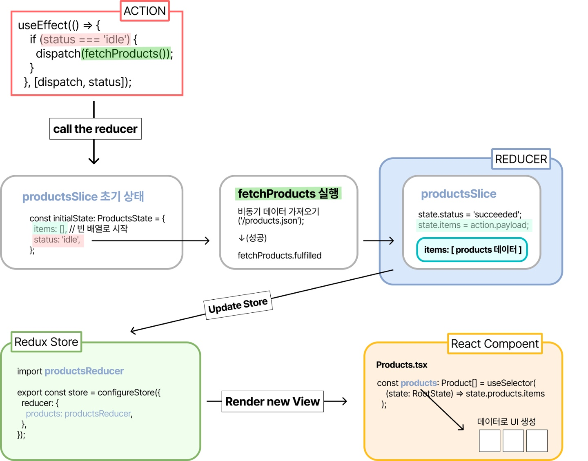
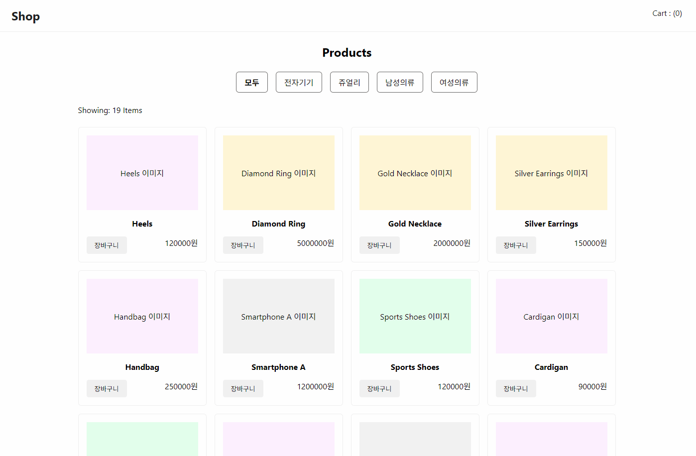
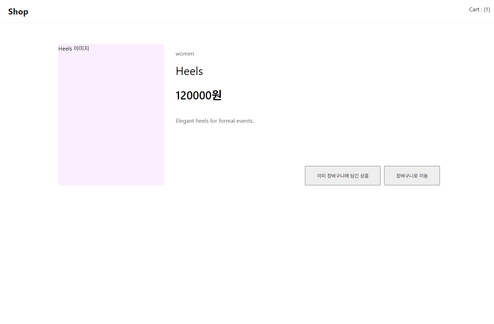

## 12 쇼핑몰 앱 만들기

### 기능목록

- json 데이터로 상품 리스트 출력
- 카테고리 별 상품 출력하기
- 상품 디테일 페이지
- 장바구니 기능

### 구현

폴더구조

```javascript
📁public
├── products.json
📁src
├── App.tsx
├── index.tsx
├── 📁app
│   └── store.ts
├── 📁components
│   ├── Nav.tsx
│   └── Products.tsx
├── 📁features
├──── 📁products
│     └── productsSlice.ts
├──── 📁cart
│     └── cartSlice.ts
├── 📁pages
│   ├── Cart.tsx
│   └── Detail.tsx
```

### productsSlice.ts : 상품 데이터 관리 (데이터 가져오기)

```javascript
// Product 타입 정의
export interface Product {
  category: string;
  name: string;
  price: number;
  description: string;
}

// ProductsState 타입 정의
interface ProductsState {
  items: Product[]; // 배열로 설정
  status: "idle" | "loading" | "succeeded" | "failed";
}

// 초기 상태 설정
const initialState: ProductsState = {
  items: [], // 빈 배열로 시작
  status: "idle",
};
```

'idle': 초기 상태로, 데이터 요청이 시작되지 않았음을 나타냄

'loading': 상품 데이터를 요청 중임을 나타낸다. 로딩 애니메이션이나 메시지를 표시할 수 있다.

'succeeded': 상품 데이터 요청이 성공. 데이터 화면에 표시 가능

'failed': 상품 데이터 요청이 실패. 오류 메시지를 표시 가능

<b>초기 상태 설정</b>
`initialState`: 리듀서에서 상태를 초기화하는데 사용 애플리케이션이 시작될 때 어떤 상태를 가지는지 정의.

데이터 요청이 이루어지기 전에는 빈 배열과 idle상태를 가지고 있다. 이후 데이터 요청이 진행되고, 성공적으로 완료되면 상태가 업데이트 됨

<b>Thunk 함수 정의 : 비동기 데이터 가져오기</b>

```javascript
export const fetchProducts = createAsyncThunk<Product[]>(
  'products/fetchProducts',
  async () => {
    const response = await fetch('/products.json'); // public 폴더의 JSON 파일을 비동기로 가져옴
    const data = await response.json(); // JSON 데이터를 파싱
    return data; // Thunk는 이 데이터를 fulfilled 상태로 반환
  }
);
```

createAsyncThunk 사용할 때 자동으로 생성되는 액션 타입

'{sliceName}/{thunkName}/pending' → products/fetchProducts/pending

'{sliceName}/{thunkName}/fulfilled' → products/fetchProducts/fulfilled

'{sliceName}/{thunkName}/rejected' → products/fetchProducts/rejected

items 상품을 여러 개의 상품을 저장할 수 있는 배열 fetchProducts 의 비동기 작업이 성공적으로 완료되었을 때,

/public/products.json에서 가져온 상품 데이터를 저장.

<b>Redux 슬라이스 정의</b>

```javascript
const productsSlice = createSlice({
  name: "products", //리듀서 이름
  initialState, // 데이터 초기
  reducers: {}, // 상태가 변하면 어떻게 실행될지
  extraReducers: (builder) => {
    builder
      .addCase(fetchProducts.pending, (state) => {
        state.status = "loading"; // 로딩 상태 처리
      })
      .addCase(fetchProducts.fulfilled, (state, action) => {
        //데이터 요청 성공
        state.status = "succeeded"; //상태 업데이트
        state.items = action.payload; // 받아온 데이터를 items에 저장
      })
      .addCase(fetchProducts.rejected, (state) => {
        state.status = "failed"; // 실패 상태 처리
      });
  },
});
```

productsSlice = createSlice : 리듀서 함수 정의

initialState 위에 설정한 초기 상태 items: [] / status: 'idle'

state는 Redux Toolkit의 createSlice를 사용하여 정의된 리듀서 함수에서 전달되는 매개변수로, 현재 상태를 나타낸다.

<b>다시 정리하는 코드 흐름:</b>
이해한 내용을 바탕으로 리덕스 데이터 플로우를 그려 봤다.


1. 초기 상태 const initialState: ProductsState = {} 에서 status는 'idle'로 설정. 이 상태는 비동기 요청이 시작되기 전.
2. 비동기 요청 시작 Products.tsx의 useEffect 훅에서 status가 'idle'일 때 dispatch(fetchProducts())를 호출 →const fetchProducts = createAsyncThunk<Product[]> 실행.
3. 데이터 요청 fetchProducts thunk는 /products.json 파일에서 상품 데이터를 비동기로 가져온다.
4. 응답 처리 요청 성공하면, Redux의 상태가 fulfilled로 업데이트.
5. 최종 상태 이때 status는 'succeeded'로 바뀌고, items 배열에는 JSON 파일에서 가져온 상품 목록이 저장됨.

<b>Products.tsx</b>

```javascript
// 컴포넌트가 처음 마운트될 데이터 비동기 요청
useEffect(() => {
  if (status === "idle") {
    dispatch(fetchProducts());
  }
}, [dispatch, status]);
```



```javascript
const filteredProducts = products.filter((product) => {
  if (selectedCategory === "모두") return true;
  if (selectedCategory === "전자기기")
    return product.category === "electronics";
  if (selectedCategory === "쥬얼리") return product.category === "jewelry";
  if (selectedCategory === "남성의류") return product.category === "men";
  if (selectedCategory === "여성의류") return product.category === "women";
  return false;
});
```

선택된 카테고리 따라 필터링 된 제품 리스트를 반환해준다. 원래는 spread operator로 데이터를 반환했는데 2주차때 작성했던 발자국을 보니 filter도 원본 배열을 수정하지 않고 새로운 배열을 반환해주는 메서드라 filter를 사용했다.

### cartSlice.ts : 장바구니 상태 관리 (상태 변경 및 업데이트)

```javascript
// cart 타입 정의
interface CartItem {
  id: string;
  name: string;
  category: string;
  price: number;
  quantity: number;
}
//CartState 타입 정의
interface CartState {
  items: CartItem[];
}
//초기 상태
const initialState: CartState = {
  items: [],
};

const cartSlice = createSlice({
  name: "cart",
  initialState,
  reducers: {
    addItem: (state, action: PayloadAction<CartItem>) => {
      // 장바구니에 아이템 추가 state는 initialState
      const existingItem = state.items.find(
        (item) => item.id === action.payload.id
      );
      // 기존에 같은 아이템이 있는지 찾기
      if (existingItem) {
        existingItem.quantity += 1; // 이미 존재하면 + 1
      } else {
        // 존재하지 않으면 새로 추가하고 수량은 1로 설정
        state.items.push({ ...action.payload, quantity: 1 });
      }
    },
    increaseQuantity: (state, action: PayloadAction<string>) => {
      // 특정 아이템의 수량 1 증가
      const item = state.items.find((item) => item.id === action.payload);
      if (item) item.quantity += 1; // 해당 아이템이 있으면 수량을 증가시킴
    },
    decreaseQuantity: (state, action: PayloadAction<string>) => {
      // 특정 아이템의 수량 1 감소
      const item = state.items.find((item) => item.id === action.payload);
      if (item && item.quantity > 1) item.quantity -= 1;
      // 아이템이 있고 수량이 1 이상일 때만 감소
    },
    removeItem: (state, action: PayloadAction<string>) => {
      // 특정 아이템을 장바구니에서 제거
      state.items = state.items.filter((item) => item.id !== action.payload);
      // 해당 아이템의 id와 일치하지 않는 아이템들로 배열을 갱신
    },
  },
});

export const { addItem, increaseQuantity, decreaseQuantity, removeItem } =
  cartSlice.actions;
// 정의한 리듀서에 해당하는 액션 생성자들을 export
export default cartSlice.reducer;
```

- productsSlice는 데이터를 가져와 저장하는 용도로 상태를 직접 변경하지 않기 때문에 reducers 값이 비어있지만 cartSlice는 사용자의 동작에 따라 상태가 동적으로 변하기 때문에 reducers를 사용한다.

<b>상품 클릭 시 /detail 페이지 이동 + 상품 장바구니 추가 기능</b>


```javascript
const { id } = useParams<{ id: string }>(); // URL에서 id 파라미터 가져오기
const dispatch = useDispatch<AppDispatch>();
```

상품을 클릭하면 상품 페이지를 보여준다.

```javascript
const product = useSelector((state: RootState) =>
  state.products.items.find((item) => item.id === id)
);
```

useParams를 통해 URL의 id 파라미터를 가져온다.

Redux의 useSelector를 사용해 products 슬라이스에서 해당 상품(id)을 검색 → 일치하는 데이터 가져옴

```javascript
const isInCart = useSelector((state: RootState) =>
  state.cart.items.some((item) => item.id === id)
);
```

useSelector를 통해 cart 슬라이스에서 해당 상품이 장바구니에 있는지 확인

some() 메서드를 사용해 장바구니에 같은 id의 상품이 있는지 여부를 반환

```html
<div className="bottom">
  {/* 장바구니에 있는 경우 텍스트 변경 */} {isInCart ? (
  <button type="button" onClick="{handleAddToCart}">
    이미 장바구니에 담긴 상품
  </button>
  ) : (
  <button type="button" onClick="{handleAddToCart}">장바구니 추가</button>
  )}
  <button type="button" onClick="{handleGoToCart}">장바구니로 이동</button>
</div>
```

```javascript
const handleAddToCart = () => {
  const cartItem = { ...product, quantity: 1 }; // quantity 추가
  dispatch(addItem(cartItem)); // Redux에 추가
};
```

장바구니 추가 핸들러

quantity 속성을 1로 설정하여 Redux 상태에 저장 dispatch를 통해 addItem 액션을 호출해 장바구니 상태를 업데이트

<b>/cart 장바구니 페이지</b>



```javascript
const dispatch = useDispatch<AppDispatch>();
const cartItems = useSelector((state: RootState) => state.cart.items);
```

Redux 스토어의 cart.items 배열을 가져온다.

```javascript
<button onClick={() => dispatch(decreaseQuantity(item.id))}> - </button>
<input value={item.quantity} readOnly />
<button onClick={() => dispatch(increaseQuantity(item.id))}> + </button>

<button className='delete' onClick={() => dispatch(removeItem(item.id))}>삭제</button>
```

수량조절 & 삭제 버튼

수량 버튼은 수량이 1 이하로 감소하지 않도록 cartSlice에서 설정한다.

```javascript
if (cartItems.length === 0) {
  return (
    <div className="wrap cart">
      <p className="none">장바구니가 비어있습니다.</p>
    </div>
  );
}
```

아이템이 하나도 없을 때는 장바구니가 비었다는 문구를 보여준다.
