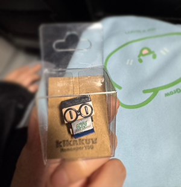

## 2024년 인프런 워밍업 클럽 스터디 2기 프론트엔드

### 1주차 - JavaScript (09.27 ~ 10.04)

1. 음식 메뉴 앱 - 객체 및 DOM, Event 다루기
2. 가위 바위 보 게임 - 함수 호출 및 이벤트 처리
3. 퀴즈 게임 - 함수 및 데이터 비교
4. 책 리스트 나열 - OOP, 비동기
5. Github Finder - OOP, 비동기

### 2주차 - JavaScript, React (10.07 ~ 10.14)

6. 비밀번호 생성 - Iterator, Generator, Design Pattern
7. 타이핑 테스트
8. 예산 계산기 - React,Tailwind
9. 디즈니 플러스 - React,styled-components, TMDB API

### 3주차 - React, Next (10.15 ~ 10.17)

10. 포켓몬 도감 앱 - React
11. 퀴즈 게임 - Next.js, TypeScript
12. 쇼핑몰 - React, Redux, TypeScript

회사 생활과 스터디를 병행하느라 잠은 줄었지만 😅
3주 동안 열심히 참여한 덕분에 우수 러너가 되었고, 귀여운 굿즈까지 받아서 보람 있었다.
